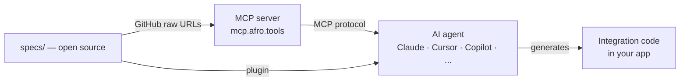

# Afro.tools — AI-ready infrastructure for African APIs

African APIs are production-grade. What's been missing is a standard, machine-readable format that lets AI coding agents consume them directly — without parsing documentation pages or guessing at request shapes.

Afro.tools fills that gap: a static, open-source registry of structured API specs for African APIs — payments, SMS, identity, logistics, and beyond. Each spec is verified against the live API and exposes exactly what an AI agent needs to generate correct integration code on the first try.

**Built for:**
- Developers integrating African APIs into their apps
- AI coding assistants (Claude, Cursor, Copilot, and others) that need reliable specs to generate code
- Contributors who want to document providers they've integrated

---

## How it works



---

## What is a spec?

A spec lives at `specs/{category}/{provider}/{capability}/` and contains exactly two files:

- **`schema.json`** — ATSS-compliant description of the API capability (endpoint, auth, input/output schemas, gotchas)
- **`canonical_example.ts`** — TypeScript implementation using native fetch, compiles with `tsc --noEmit`

See [ATSS.md](./ATSS.md) for the full specification.

---

## Providers

| Provider | Category | Country | Capabilities | Status |
|---|---|---|---|---|
| Paycard | payment | GN | create_payment, verify_payment, webhook_payment_completed | ✅ Verified |
| LengoPay | payment | GN | create_payment, verify_payment, webhook_payment_completed | ✅ Verified |
| Wave | payment | SN, CI, ML | create_payment, verify_payment, webhook_payment_completed | Planned |
| Djomy | payment | GN | create_payment, verify_payment | Planned |
| Bictorys | payment | — | create_payment, verify_payment, webhook_payment_completed | Planned |
| NimbaSMS | sms | GN | send_otp, send_bulk | Planned |

---

## Use with an MCP client

Add to your MCP client configuration:

### Claude Desktop (`claude_desktop_config.json`)

```json
{
  "mcpServers": {
    "afrotools": {
      "type": "http",
      "url": "https://mcp.afro.tools/mcp"
    }
  }
}
```

### Cursor / Windsurf / other editors

```json
{
  "mcp": {
    "servers": {
      "afrotools": {
        "type": "http",
        "url": "https://mcp.afro.tools/mcp"
      }
    }
  }
}
```

### Claude Code (CLI)

```bash
claude mcp add --transport http afrotools https://mcp.afro.tools/mcp
```

Or add to your project's `.mcp.json`:

```json
{
  "mcpServers": {
    "afrotools": {
      "type": "http",
      "url": "https://mcp.afro.tools/mcp"
    }
  }
}
```

---

## Claude Code plugin

Install the plugin to get Afro.tools skills directly in your editor:

```text
/plugin marketplace add afrotools/afrotools
/plugin install afrotools
```

The plugin includes:

**Auto-activated skills** (trigger automatically based on your request):

- **`payment`** — integrating a payment API → fetches the right spec before writing any code
- **`sms`** — integrating an SMS API → same
- **`debug`** — debugging a failing integration → cross-checks your code against the spec and gotchas

**Manual commands:**

- **`/afrotools:spec <provider> <capability>`** — inspect the full spec for a provider/capability
- **`/afrotools:list`** — list all available specs with their status
- **`/afrotools:new <category> <provider> <capability>`** — scaffold a new spec (for contributors)

---

## Standalone SKILL.md

If you don't use the plugin, you can copy a single `SKILL.md` into your project:

```text
plugin/skills/payment/SKILL.md   ← for payment integrations
plugin/skills/sms/SKILL.md       ← for SMS integrations
```

Place it in your project's `.claude/skills/` directory and Claude Code will pick it up automatically.

---

## Contributing

See [CONTRIBUTING.md](./CONTRIBUTING.md) to add a spec or improve an existing one.

All specs go through a lifecycle: `draft → compliant → verified`.
A provider is **AI Ready** when all its capabilities reach `verified`.

---

## License

Apache 2.0 — see [LICENSE](./LICENSE).
